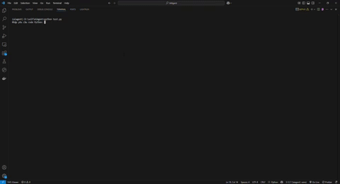
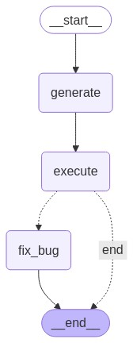

# Multi-Agent AI System for Code Generation, Execution, and Bug Fixing

## Overview

This project implements a **Multi-Agent AI System** designed to generate Python code based on user prompts, execute the generated code, and automatically fix bugs if they occur. The system leverages advanced AI tools and frameworks to streamline the coding process, making it an ideal tool for developers, learners, and automation enthusiasts.

### Demo



### Key Features
- **Code Generation**: Generates optimized Python code based on natural language prompts.
- **Code Execution**: Runs the generated code and installs required libraries automatically.
- **Bug Fixing**: Detects errors during execution and attempts to fix them iteratively.
- **Visualization**: Provides a graphical representation of the workflow using LangGraph.

### Technologies Used
- **LangChain**: For building and managing the AI agents.
- **LangGraph**: To define and visualize the multi-agent workflow.
- **Gemini API**: Powers the AI-driven code generation and bug fixing (via Google Generative AI).
- **DuckDuckGo Search**: Enhances the bug-fixing agent with web search capabilities.
- **Python**: Core programming language for the system.

## Project Structure

The system consists of three main agents:
1. **Code Generation Agent**: Creates Python code from user prompts and saves it to a local file.
2. **Execution Agent**: Executes the generated code, installs dependencies, and captures output or errors.
3. **Bug-Fixing Agent**: Analyzes execution errors, modifies the code to fix bugs, and re-runs it.

### Workflow
- **Input**: User provides a prompt (e.g., "Code a heart shape and display it").
- **Generate**: The code generation agent creates a Python file.
- **Execute**: The execution agent runs the code and checks for errors.
- **Fix Bugs**: If errors occur, the bug-fixing agent attempts to resolve them.
- **Output**: The final code file path and execution output are returned.

The workflow is visualized as follows (generated using Mermaid):

  
*(Run the project to generate this graph locally)*

## Installation

### Prerequisites
- Python 3.8+
- A Google API key for the Gemini API (set in a `.env` file as `GOOGLE_API_KEY`).

### Setup
1. Clone the repository:
   ```bash
   git clone https://github.com/yourusername/multi-agent-ai-system.git
   cd Auto-Python-Code-Generation-Bug-Fixing-and-Experimentation-with-Multi-Agent-AI-System
   ```

2. Install dependencies:
   ```bash
   pip install -r requirements.txt
   ```

3. Create a `.env` file in the root directory and add your Google API key:
   ```
   GOOGLE_API_KEY=your-google-api-key
   ```

4. Run the project:
   ```bash
   python main.py
   ```

### Requirements
The following packages are required (automatically installed via `requirements.txt`):
```
langchain==0.2.16
langchain-community==0.2.16
langchain-openai==0.1.23
langgraph==0.2.18
langsmith==0.1.114
langchain-google-genai
duckduckgo-search
python-dotenv
```

## Usage

1. Launch the script and enter a prompt when prompted:
   ```
   Enter your request for code Python: Code a heart shape and display it
   ```

2. The system will:
   - Generate a Python file (e.g., `heart.py`).
   - Execute the code and display the output.
   - Fix any bugs if errors are detected.

3. Example output:
   ```
   Generated Code:
    File path: heart.py

   Execution Output:
    A heart shape was drawn on the screen using Python's Turtle graphics.
   ```

## How It Works

### Workflow Graph
The `LangGraph` framework orchestrates the agents with the following flow:
- `START` → `generate` → `execute` → (`fix_bug` if errors) → `END`.

## Contributing

Contributions are welcome! Please follow these steps:
1. Fork the repository.
2. Create a new branch (`git checkout -b feature/your-feature`).
3. Commit your changes (`git commit -m "Add your feature"`).
4. Push to the branch (`git push origin feature/your-feature`).
5. Open a Pull Request.

## License

This project is licensed under the MIT License. See the [LICENSE](LICENSE) file for details.

## Acknowledgments

- Built with inspiration from LangChain and LangGraph documentation.
- Powered by the Gemini API from Google.
- Special thanks to the open-source community for tools like DuckDuckGo Search.
